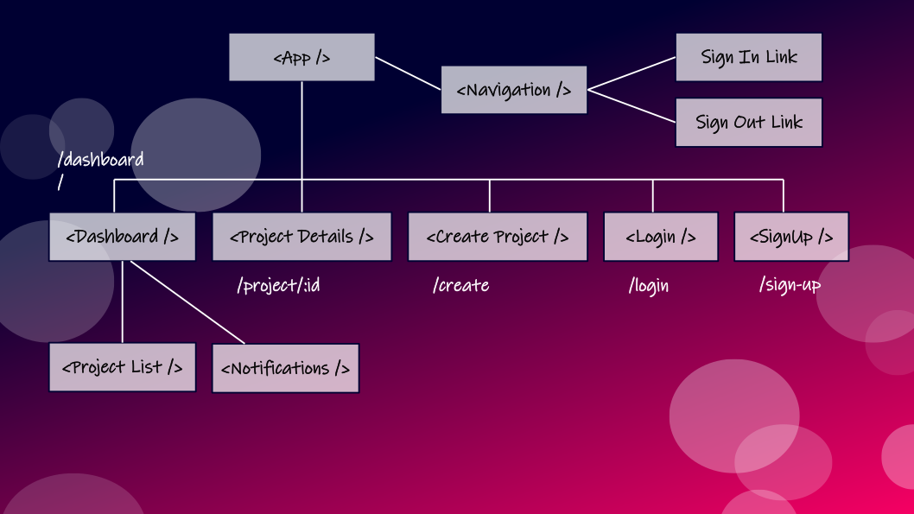
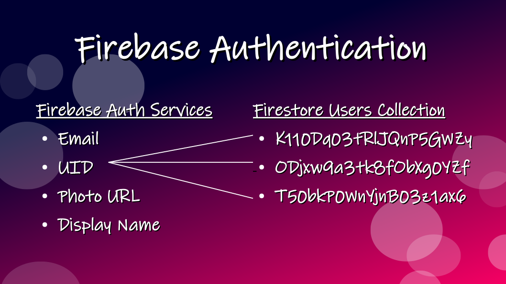

# EVENT CENTRAL - Project Management Tool

Event Central, a project management tool prototype.

## Tech Stack

  1.  React - Frontend
  2.  Redux - State Management
  3.  Thunk - Middleware for asynchronous functions
  4.  Firebase - Backend with:
        - Firestore
        - Authentication

## Content Strategy

### Thunk

Thunk allows functions to be returned inside redux action creators which can then interact with the database.

*NOTES*

 - Include the firebase app in the config file export for use in `reduxFirestore` and `reactReduxFirebase` or errors may occur

## State Management

For this project, I specifically chose `Redux` to study its implementation in broader detail. It requires extensive setup to integrate with React and seems like overkill for smaller projects.

For simple apps, Reacts built-in `Context API` may be the solution for when you need quicker prototyping with minimal Setup. However, the `Context API` is *not a 'state management' tool*. It's a **Dependency Injection mechanism**. It just gives you a way to pass your data down a deeply nested tree of React components.

For Reference, Mark Erikson (Redux maintainer) has written some helpful articles:
  - [React, Redux, and Context Behavior](https://blog.isquaredsoftware.com/2020/01/blogged-answers-react-redux-and-context-behavior/)
  - [A (Mostly) Complete Guid to React Rendering Behavior](https://blog.isquaredsoftware.com/2020/05/blogged-answers-a-mostly-complete-guide-to-react-rendering-behavior/#final-thoughts)
  - [Redux - Not Dead Yet!](https://blog.isquaredsoftware.com/2018/03/redux-not-dead-yet/)

## Firebase Authentication

## Notes

- Added moment.js for improved date formatting
- Implemented basic security rules on Firebase Firestore
- Intended to set up Cloud functions, however Firebase no longer has a free tier for their Cloud functions.