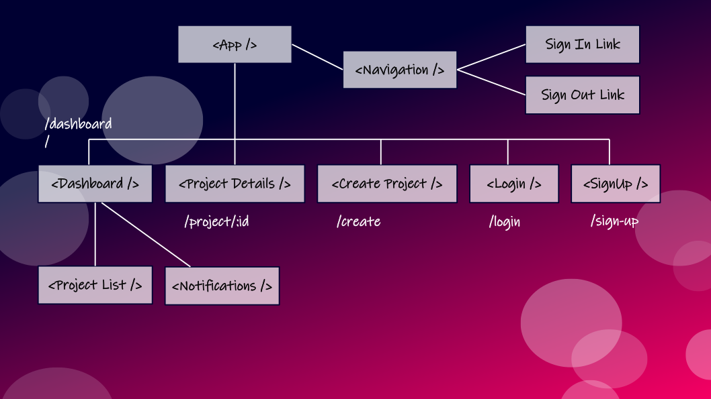

# EVENT CENTRAL - Project Management Tool

Event Central, a project management tool prototype for teams.

## Tech Stack

  1.  React - Frontend
  2.  Redux - State Management
  3.  Thunk - Middleware for asynchronous functions
  4.  Firebase - Backend with:
        - Firestore
        - Cloud functions
        - Authentication
        - Deployment

## Content Strategy

### thunk

Thunk allows functions to be returned inside the action creators which can then interact with the database.

*NOTES*

 - Include the firebase app in the config file export for use in reduxFirestore and reactReduxFirebase or errors may occur